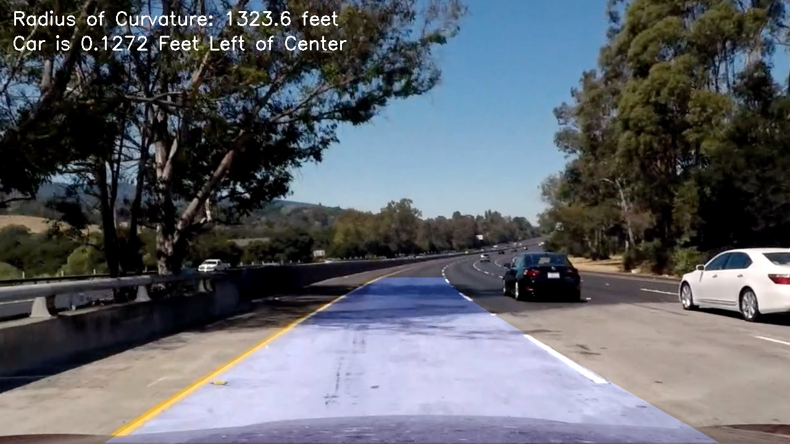

## Project 4 - Advanced Lane Lines
### Project Goals
- Compute the camera calibration matrix and distortion coefficients given a set of chessboard images.
- Apply a distortion correction to raw images.
- Use color transforms, gradients, etc., to create a thresholded binary image.
- Apply a perspective transform to rectify binary image ("birds-eye view").
- Detect lane pixels and fit to find the lane boundary.
- Determine the curvature of the lane and vehicle position with respect to center.
- Warp the detected lane boundaries back onto the original image.
- Output visual display of the lane boundaries and numerical estimation of lane curvature and vehicle position.

---

### Camera Calibration

The first step in the process of drawing accurate lane lines on an image is to correct for the distortion that the camera lens adds. As I wanted to potentially use this code independently from my image process pipeline, it is written in a separate file called "calibrate.py."

I start by preparing "object points", which will be the x, y, and z coordinates of the chessboard corners in the world. Because the chessboard is on a flat plane, the z component will be ignored. The "image points" are x and y pixel position of each of the corners in the image plane.  

I then used the output "objpoints" and "imgpoints" to compute the camera calibration and distortion coefficients using the "cv2.calibrateCamera" method.  I applied this distortion correction to the test image using the "cv2.undistort" function and generated the below image:

The calibration "imgpoints" and "objpoints" are then stored in a pickled file for use by the main image processing pipeline.

### Pipeline (Static Images)

#### Distortion Correction

Using the imported distortion correction data, I apply it to the test images as the first step in my pipeline. And example can be seen below. As a note, the image was loaded with CV2, and the R and B color channels are swapped.

#### Thresholding

After correcting for camera distortion, I used 1 color threshold and 4 different gradient thresholds transformations on each of the test images. The gradient transformations were Sobel (in X and Y directions), magnitude of the gradient, and the direction of the gradient. The application of these thresholds can be found on lines 357 through 370 in the file "pipeline.py." Examples of the 4 gradient transforms can be seen below, all performed on the same test image.

For the color threshold, the source image was converted to the hue, saturation, and lightness (HSL) color space. The hue and lightness channels were dropped, leaving just the amount of saturation. Finally, only pixels with saturation within the threshold were kept, and a binary image returned. Below is the result of a saturation threshold on the same image as above.

After generating all of the above thresholded images, these were then compared to one another to generate a final combined output. This can be seen in lines 372 through 374 of "pipeline.py."

#### Perspective Transform

The code for my perspective transform includes a function called "warp", which appears in lines 47 through 61 in the file "pipeline.py." The "warp" function takes an image, and uses source and destination points to transform the road in front of the car to a birds-eye perspective. The source points were generated by looking at an image where the lane lines are straight, and generating a trapezoidal window with sides parallel to the lane lines

The source and destination points I used are as follows:

| Source        | Destination   |
|---------------|---------------|
| 190, 720      | 300, 720      |
| 1125, 720     | 980, 720      |
| 593, 450      | 300, 0        |
| 687, 450      | 980, 0        |

I verified that my perspective transform was working as expected by drawing the source and destination points onto a test image and its warped counterpart to verify that the lines appear parallel in the warped image, as seen below:

The "warp" function also returns the transformation matrix and inverse of that matrix for use in future functions.

#### Polynomial Fit

To generate a virtual representation of each lane line, a starting point was needed. A histogram was applied to the bottom of the image, showing where the most white pixels were in the vertical columns of the image. The areas with the highest concentrations on the respective sides of the image were considered to be the starting points of each lane line. A sliding window search was then conducted to find the areas of highest pixel concentration extending vertically from the starting points. From this search, polynomials were fit to the groups of concentrated pixels, and returned to the main pipeline.

A representation of this process can be seen below:

#### Lane Curvature and Position

Lane curvature and car position are determined by two functions. The first, "calc_curvature_radius" (lines 125-151 in "pipeline.py"), uses the left and right fit polynomials to determine the curvature in pixels of each side. Then, the curvature is averaged, and converted to feet using DOT lane width and spacing guidelines to convert between pixels and feet.

The position of the car relative to the lane is found using the function "calc_center_offset" (lines 113-122 in "pipeline.py"). This function also uses the left and right polynomial fits, and then finds the base of each line by evaluating each polynomial with the y value for the bottom of the screen. It is assumed that the camera is mounted at the center of the windshield, and thereby mounted in the center of the car. Using this information, the center of the image is compared to half the distance between the two lane line termination points.

#### Result

The final two steps are found in the methods "draw_lines" (lines 293 - 320 in "pipeline.py") and "draw_labels" (lines 323 - 341 in "pipeline.py"). The first method, "draw_lines," takes the left and right fit polynomials, as well as the inverse of the transformation matrix used to warp the image to birds-eye view. The function draws a filled polygon on the warped image, and then uses the inverse matrix to return it to the normal (yet undistorted) view.

The image is then passed to the second function, "draw_labels", along with the earlier calculated curvature radius and offset from center. The function simply uses OpenCV methods to draw the data at the top left corner of the image. An example of an image after completion of the pipeline can be seen below:

---

### Pipeline (Video)

The pipeline performed reasonably well when used on a video, but took a long time to generate the end result. Even for roughly 40 seconds of video, at 30 frames per second, that is over 1200 individual images to be processed. To alleviate some of the process intensity, I implemented a margin search that seeks to fit a polynomial to the pixels in the next frame, but only looks within a certain margin determined by the previous frame.

Also, in an attempt to prevent catastrophic failures in lane line determination, I implemented a history check (function "check_fit_history", lines 259-290) to average the fits from the previous 10 frames of video, and to use that average in the case that the current frame's fit deviated too far from the average. In this way, I was able to keep the lanes line drawings relatively smooth.

My video result can be [found here.](./output_images/video_out.mp4)

---

### Reflection

The biggest issue with my pipeline is the handling of lighter patches of road. The lane lines are applied very consistently throughout the video, except in the first curve where the lane line was very difficult to identify visually, as it was nearly the same color as the background. To alleviate this, it might be possible to add additional thresholds and consider different color channels from the HSL conversion, or else lighten or darken images before applying the thresholds. Also, because this is a short section of the video, this issue might also be solved by averaging a greater number of frames in the "check_fit_history" method.
